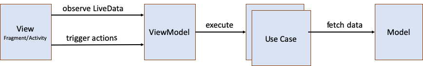
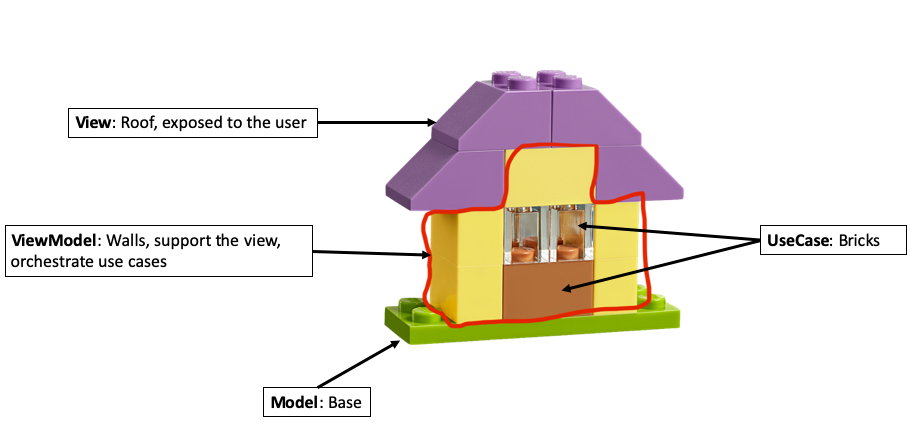

# uMvvm

uMvvm ("usecase model view viewmodel") is a lightweight framework to
facilitate the implementation of Android apps written in Kotlin using
Jetpack components (ViewModel, LiveData). It is best suitable for
business applications, where every screen basically does the following:
1. Load data from an API
2. Apply some business rules and show the data to the user
3. Allow the user to modify the data and validate the modifications
4. Push modified data to an API

uMvvm leverages the power of Kotlin coroutines to provide an effortless
mechanism to run code off the UI thread. To that end, in addition to the
standard components of MVVM (model, view, view model), it adds a fourth
component to the mix: use cases. In the architecture diagram, use cases
sit between the view model and the model:



In a nutshell, the components can be described as follows (uMvvm class
names in brackets):
- The **View (BaseViewFragment/BaseViewActivity)** shows data to the
  user and receives user input
- The **ViewModel (BaseViewModel)** holds the state and exposes it to
  the view using LiveData. It exposes methods to react to actions by the
  user and handles them by executing one or more UseCase(s), updating
  it's LiveData as a result.
- A **UseCase (UseCase)** is a single purpose, reusable logic block that
  implements the business rules. A complex ViewModel might be composed
  of many UseCases.
- The **Model** defines the domain models and contains repository
  interfaces though which the domain models are loaded, created and
  modified.

## How to Use uMvvm
Follow the example at [uvvm-demo](https://github.com/snellen/umvvm-demo)
- Implement the view by extending
  ch.silvannellen.umvvm.view.BaseViewFragment/ch.silvannellen.umvvm.view.BaseViewActivity
- Implement the view model by extending
  ch.silvannellen.umvvm.viewmodel.BaseViewModel
- Implement the use cases by implementing the interface
  ch.silvannellen.umvvm.usecase.UseCase

Experience shows that ViewModels tend to get big. To minimise the size
in a view model, move any business logic to a UseCase.

### UseCases and Running Code Off the Main/UI Thread
In abstract terms, a **UseCase** is a component that takes an input and
returns an output. Examples are:
-   a UseCase that logs in a user might take user name and password as
    input and return a boolean value to indicate whether the credentials
    are valid:
    [LoginUseCase](https://github.com/snellen/umvvm-demo/blob/develop/app/src/main/java/ch/silvannellen/githubbrowser/usecase/login/LoginUseCase.kt).
-   a UseCase that takes a list of items as input and filters them
    according to a search query:
    [SearchCommitsUseCase](https://github.com/snellen/umvvm-demo/blob/develop/app/src/main/java/ch/silvannellen/githubbrowser/usecase/searchcommits/SearchCommitsUseCase.kt).
    (This is an example of a use case that does not interact with a
    repository)

The interface of a UseCase is therefore defined as follows:

```kotlin
interface UseCase<InputType, OutputType> {
    suspend fun execute(input: InputType): OutputType
}
```
To enable the use cases to switch to a background thread (if required),
the execute method is marked with the suspend keyword. Consequentially,
the ViewModel has to call the method in the context of a coroutine.
Thus, the pattern suggested to execute a UseCase in a ViewModel is:
```kotlin
launch {
    // This code runs on the main thread.
    // set busy LiveData to true
    val result = someUseCase.execute(someInput)
    // clear busy flag, process result, update LiveData
}
```
In uMvvm, all coroutines launched in a ViewModel run on the main thread.
The reasons for this are:
1. To greatly reduce the risk of race conditions when updating the model
   state
2. In most cases, the ViewModel updates some LiveData after executing a
   UseCase. This has to be done on the main thread or the app crashes if
   setValue instead of postValue is used.

Any coroutines launched in the ViewModel are cancelled when the view
model is cleared. This is to ensure that no view model instances are
leaked by a blocked background task holding a reference to it.

## The uMvvm Brick House
A more playful way to think of the componets in uMvvm is to imagine them
as part of a brick house:



In that analogy, the walls (ViewModel) are composed by bricks
(UseCases). They rest on the base (Model) and hold up the roof (View)
which is exposed to the ~~weather~~ user.

The logic implemented by the ViewModel consist of UseCases and some glue
code between them. UseCases can build upon each other with one use case
consuming the result returned by another. For example, the
[SearchCommitsUseCase](https://github.com/snellen/umvvm-demo/blob/develop/app/src/main/java/ch/silvannellen/githubbrowser/usecase/searchcommits/SearchCommitsUseCase.kt)
processes the result returned by the
[LoadCommitsUseCase](https://github.com/snellen/umvvm-demo/blob/develop/app/src/main/java/ch/silvannellen/githubbrowser/usecase/loadcommits/LoadCommitsUseCase.kt)
The view never directly accesses the model (except for the domain
objects), but only touches the view model.

## Testing
The [umvvm-test](https://github.com/snellen/umvvm-test) repository
contains utilities to unit test ViewModels and UseCases.

To unit test a UseCase, extend TestBase. This class replaces the main
coroutine dispatcher with a mocked version that exposes useful methods
for testing, such as the ability to forward time to skip past any
delay() calls in the code (See
[official documentation](https://kotlin.github.io/kotlinx.coroutines/kotlinx-coroutines-test/kotlinx.coroutines.test/-test-coroutine-dispatcher/))

```kotlin
class SomeUseCaseImplTest : TestBase() {

    lateinit var testee: SomeUseCase
    
    val mockDependency = Mockito.mock(DependencyProvider::class.java)

    @Before
    fun setup() {
        testee = SomeUseCaseImpl(mockDependency)
    }
    
    @Test
    fun `given some condition, when a method is called, then expect a result`() = runBlocking {
        // Use runBlocking to run test in the context of a coroutine, which is required to be able to call
        // testee.execute()
    }
}
```

To unit test a BaseViewModel, extend ViewModelTestBase. This class
removes the dependency of LiveData on the main thread, as well as
mocking the main coroutine dispatcher. The pattern for unit tests of
implementations of BaseViewModel is:
```kotlin
class SomeViewModelImplTest : ViewModelTestBase() {

    lateinit var testee: SomeViewModel

    private val mockSomeUseCase = Mockito.mock(SomeUseCase::class.java)

    @Before
    fun setup() {
        testee = SomeViewModel(mockSomeUseCase)
    }

    @Test
    fun `given some condition, when a method is called, then expect a result`() {

    }
}
```


## Full Example
The [uvvm-demo](https://github.com/snellen/umvvm-demo) repository
demonstrates the use of uMvvm as well as patterns I consider best
practice.
